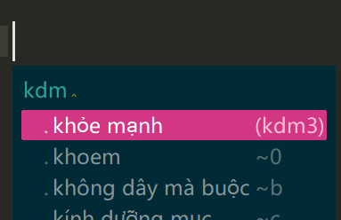
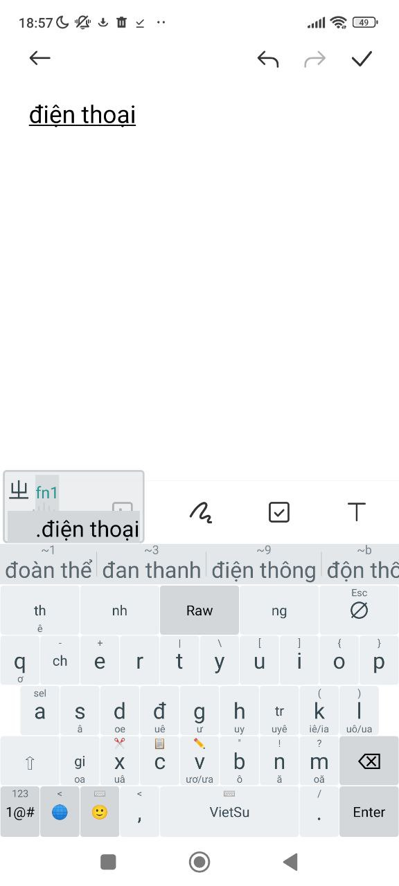
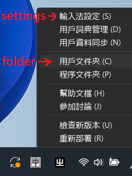
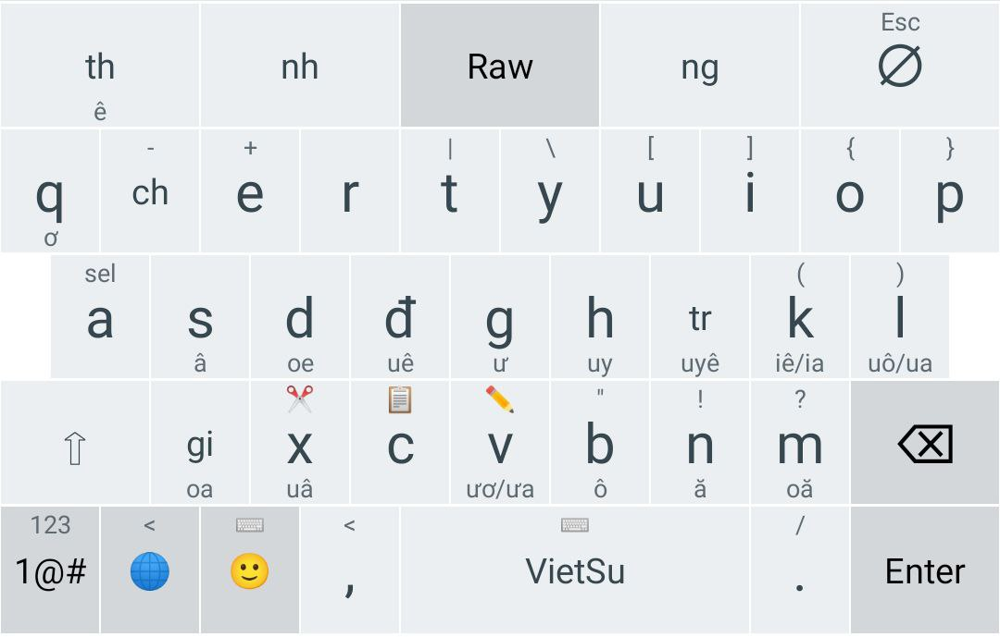
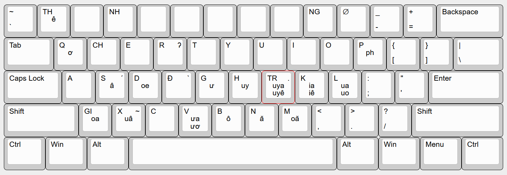

# VQuick: type fast in Vietnamese

 - All words are typed with abbreviations called codes. They are usually 2-4 letters long.
 - Codes are formed according to specific clear rules so it's really intuitive and you almost never need to memorize them.
 - Works on all platforms (Windows, Android, Linux, iOS, Macbook)




Some examples
-----
- không → `k`
- biết → `bt`
- sân bay → `snby`
- kết quả → `ktqa`
- ký túc xá → `ktx`
- cửa hàng dược phẩm → `chdp`

All the specific rules on how to figure out the codes are listed below.

How to install on Windows
===

1. Install Rime from [official github rep](https://github.com/rime/weasel/releases/download/0.14.3/weasel-0.14.3.0-installer.exe) or [official website](https://rime.im/download/). The software is in Chinese but don't worry.

2. The version of Rime for Windows is unfortunately outdated so we need to update it.

- Download [zip with the latest updates](https://github.com/rime/librime/releases/download/1.8.5/rime-08dd95f-Windows.7z) from the official RIME repository.

- Find the file `dist/lib/rime.dll` and copy it.

- Open your Weasel directory, for example `C:\Program Files (x86)\Rime\weasel-0.14.3` and replace `rime.dll` with the new one.

- Restart your PC

3. Installing the keyboard files

- Switch the language and then on the panel you should see an icon `中`. Right-click it and choose `用戶文件夾（C）`. A folder should open.



- Download the [files](https://github.com/scorpjke/rime-vietnamese/archive/refs/heads/master.zip) from VQuick repository and copy them to the Rime folder that opened in the previous step (but if you had Rime installed before, be careful to not replace important files so read below **if you already had Rime installed before**).

- Right-click the icon `中` and choose `輸入法設定（S）`. A settings window should open.

- In that window tick `VQuick` (untick everything else, unless you want to type in some Chinese keyboards) and click the button `中`.

How to install on Android
===

1. Install Trime (同文輸入法) if you don't have it.

- Install it from [Google Play](https://play.google.com/store/apps/details?id=com.osfans.trime&hl=en&gl=US) or [F-Droid](https://f-droid.org/en/packages/com.osfans.trime/) or [official github rep](https://github.com/osfans/trime/releases).

- Open the app and follow the instructions (Enable input method, etc).

3. Open the File Explorer and make sure that `rime` folder appeared in the root directory.

4. Download the [files](https://github.com/scorpjke/rime-vietnamese/archive/refs/heads/master.zip) from VQuick repository and copy them to that `rime` folder (if you already had Rime installed before, read below first!).

5. Shut down the app and reopen it.

6. Open the app, press `Select schemas` and choose VQuick.

7. Press `Profile` -> `Sync user data`

8. Press `Deploy` and wait. When it finishes, press `OK thanks`

9. Shut down the app and reopen it.

11. Open some search bar and a messenger to test whether the keyboard shows up and you can type with it. If it works, congratulations!

12. Open the app, press `Keyboard settings` and turn on `Click candidate`.

13. That's it! Later you can look through and change some other settings to make it more comfortable for you personally.


If you already had Rime installed before (any platform)
---
When copying files, it might ask you to replace some existing files.

- if your folder already has `rime.lua`, don't replace it. Open it in a text editor and just add the contents of VQuick's `rime.lua` to the end of your file.

- As for the other files like `punctiation.yaml` and `key_bindings.yaml` - you can just skip them, no need to replace them.

If you already use other Rime layouts on Android.
---
Identify which theme you use, you can see that in the settings. Most likely you use the default one called `trime` or perhaps another default one called `tongwenfeng`. Open (or create if it doesn't exist) file `your_theme_name_here.custom.yaml` and add the following:
```
patch:
  __include: ~trime.custom.keyboard.scorp:/
```


How to know the codes
---------------------------------
Firstly, let's deal with the terminology. The Vietnamese syllable consists of three parts: *initial, middle, final*. For example:

- **phòng** → initial: **ph**, middle: **o**, final: **ng**
- **khỏe** → initial: **kh**, middle: **oe**, final: **---**

If you see a sequence of vowels that ends in **i/y/o/u**, then that last vowel is actually a final. For example:

- **người** → initial: **ng**, middle: **ươ**, final: **i**
- **báo** → initial: **b**, middle: **a**, final: **o**
- **sau** → initial: **s**, middle: **a**, final: **u**

Each initial, middle and final is typed with one key. Here is the image of the keyboard:





Two-syllable words
-----

That's the easiest and the most powerful one since we can type many thousands of words with it easily. In order to type a two-syllable word, it's almost always going to be **FLFL** (first last fist last). For example:
- Việt Nam → `vtnm`
- sinh viên → `s3vn`

If your word is not common enough, it might be of the form **IIMF** (initial initial middle final) or **IMFI** (initial middle final initial).


One-syllable words
-----
Firstly, we're going to need to know the keys for the tones. It's a standard scheme used in most Vietnamese layouts:

`r` = ả, `f` = à, `s` = á, `x` = ã, `j` = ạ, `0` = a

So, there are two major ways to type one syllable words, let's study them in detail. 

1) Full-code
   
   It means you type out everything in the syllable: initial, middle, final and tone. Since each of those are typed with 1 key, the maximum length of such a code is 4 keypresses. For example:

   - bạn → `banj`
   - khỏe → `kdr` (because **oe** is located on the same key as `d`)
   - tiếng → `tk9s` (**iê** is located on `k`)
   - tôi → `tbi0` (because the word has no tone, we type `0` at the end)
   - ấy → `0sys` (if the syllable has no initial and it starts with a vowel with diacritics then the code starts from `0`)

3) Short code
   
   Almost all common one-syllable words have a short code so you'll almost never need to use the full code. We have:

   One-letter codes:
   - bạn → `b`
   - không → `k`
   - một → `m`
   
   FL (first last) codes:
   - tốt → `tt`
   - phòng → `p9`
   - giờ → `zq`
   
   IMF (initial middle final) codes. So they're basically the same as full codes except you don't type the tone.
   - tiếng → `tk9`
   - tuần → `txn`
   - tối → `tbi`
   
   FT (first tone) codes:
   - bởi → `br`
   - quần → `qf`
   - hãy → `hx`

If there are so many types of codes, how do I know which one to use?
---

Well, you can always use the full code, that's a 100% guarantee and it's still faster than other keyboards. But if you want to type lightning fast, it will require a little bit of memorization. Firstly, speaking of 1-letter codes, we only have around 30 of them and those are 30 extremely common words that you'll type all the time so you'll remember them fast. Then we have FT codes which are very rare and they really were created as a last resort. There aren't many of them and you should never expect an FT code to exist by default.

Then the general instruction for typing 1-syllable words is simple: if the word is really common, try the **FL** code. If it didn't show up, try **IMF** (the word in full without the tone) and hopefully the tone will be attached by default. Otherwise add the tone manually.


Three-syllable words
-----
Firstly, any three-syllable word can be typed with **FLFLFL**. For example:
- không bao giờ → `k9bozq`

But common words additionally have shorter codes.
If the word is really common, try **FFF**. For example:
- không bao giờ → `kbz`
- phòng thể dục → `p1d`
- người phụ nữ → `9pn`

If your word doesn't show up, you can try **FFFL** or **FLFF**.

Words with 4 or more syllables
-----
They can be typed by using their first letters only. For example:

- nhân viên cứu hỏa → `3vch`
- chúc mừng sinh nhật → `wms3`


Important note regarding full codes
---

FL codes: if the word starts with a vowel, we don't search for that vowel on the keyboard but instead we just remove the diacritics. For example:

- uống → `u9` (not k9)
- âm → `am` (not sm)

The letter Q: "u" is considered to be a part of the initial so it's not included in the middle. For example:

- quận → `qsn` (not qxn)
- quyền → `qkn` (not qjn; the formula here is considered to be **qu** + **yên/iên**)

Capitalization
---
1) The wave method

   Here's how it works. Imagine you've typed a 3-syllable word. Now you can capitalize any syllables you want by providing a pattern: `Tab` (meaning uppercase) and `/` (meaning lowercase). For example:
   - `Tab`: Phòng thể dục
   - `Tab` `Tab`: Phòng Thể dục
   - `Tab` `Tab` `Tab`: Phòng Thể Dục
   - `/` `Tab` `Tab`: phòng Thể Dục
   - `/` `Tab`: phòng Thể dục
  
3) `Ctrl` + `C`: all-caps of the current word only
4) `Ctrl` + `A`: toggle CAPSLOCK. All words will be typed in CAPS until it's turned off.

General tips
----
1. Don't choose words from the list. It isn't necessary and it slows down your typing. Just type the code and if you see that your word shows up as #1 then just press `Space` or `,` or any other punctuation mark.

Tips for PC
---
- Press `Esc` erase your current input.
- Press `Ctrl` + `Enter` to commit raw input, i.e. when you want the input to be treated literally, not as a code.
